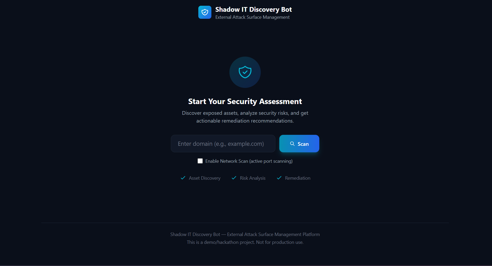

# Shadow IT Discovery Bot

An External Attack Surface Management (EASM) platform that discovers, analyzes, and visualizes publicly exposed organizational assets.



## Features

- **Asset Discovery**: Identify internet-facing services using Shodan API or network scanning
- **Risk Analysis**: Rule-based security assessment with severity scoring
- **Remediation Recommendations**: Actionable guidance prioritized by risk level
- **Security Posture Score**: Overall organizational security health metric
- **Interactive Dashboard**: Real-time visualization with charts and filtering

## Tech Stack

### Backend
- **FastAPI** - Modern async Python web framework
- **Pydantic** - Data validation and serialization
- **httpx** - Async HTTP client for API calls
- **aiofiles** - Async file I/O for JSON storage

### Frontend
- **Vanilla JavaScript** - No framework dependencies
- **Tailwind CSS** (CDN) - Utility-first styling
- **Chart.js** - Interactive data visualizations

### Data Sources
- **Shodan API** - Internet-wide asset discovery (requires API key with credits)
- **Network Scanner** - Direct port scanning (opt-in, requires permission)
- **Mock Data** - Demo fallback when APIs unavailable

## Quick Start

### Prerequisites
- Python 3.10+
- pip

### Installation

```bash
# Clone repository
git clone https://github.com/yourusername/shadow-it-discovery-bot.git
cd shadow-it-discovery-bot

# Install dependencies
cd backend
pip install -r requirements.txt

# Configure environment (optional)
cp .env.example .env
# Edit .env with your Shodan API key if available
```

### Running the Application

```bash
# From backend directory
cd backend
python -m uvicorn main:app --host 0.0.0.0 --port 8000
```

Open http://localhost:8000 in your browser.

### API Documentation

Once running, visit:
- **Swagger UI**: http://localhost:8000/docs
- **ReDoc**: http://localhost:8000/redoc

## API Endpoints

| Method | Endpoint | Description |
|--------|----------|-------------|
| POST | `/api/scan` | Start a new asset discovery scan |
| GET | `/api/scan/{id}/status` | Poll scan progress |
| GET | `/api/results/{id}` | Get full scan results |
| GET | `/api/dashboard/{id}` | Get dashboard visualization data |
| GET | `/api/assets/{id}` | List discovered assets |
| GET | `/api/recommendations/{id}` | Get remediation recommendations |

### Example: Start a Scan

```bash
curl -X POST http://localhost:8000/api/scan \
  -H "Content-Type: application/json" \
  -d '{"domain": "example.com", "enable_network_scan": false}'
```

## Project Structure

```
Shadow/
├── backend/
│   ├── main.py              # FastAPI application entry point
│   ├── config.py            # Settings and environment config
│   ├── requirements.txt     # Python dependencies
│   ├── .env                  # Environment variables (gitignored)
│   ├── models/              # Pydantic data models
│   │   └── asset_models.py
│   ├── routers/             # API route handlers
│   │   └── scan_routes.py
│   ├── services/            # Business logic
│   │   └── scan_service.py
│   ├── discovery/           # Asset discovery modules
│   │   ├── asset_discovery.py
│   │   └── network_scanner.py
│   ├── analysis/            # Risk analysis
│   │   └── risk_engine.py
│   ├── intelligence/        # Recommendations
│   │   └── recommendation_engine.py
│   ├── storage/             # Data persistence
│   │   └── database.py
│   ├── utils/               # Utilities
│   │   └── rate_limiter.py
│   └── data/
│       ├── mock/            # Mock data for demos
│       └── scans/           # JSON scan results (gitignored)
├── frontend/
│   ├── index.html           # Main dashboard
│   ├── css/
│   │   └── custom.css       # Custom styles
│   └── js/
│       ├── api.js           # Backend API client
│       ├── app.js           # Main application logic
│       ├── charts.js        # Chart.js configurations
│       └── utils.js         # Utility functions
└── plan/                    # Project planning docs
```

## Configuration

Environment variables (`.env`):

| Variable | Description | Default |
|----------|-------------|---------|
| `SHODAN_API_KEY` | Shodan API key for asset discovery | None (uses mock data) |
| `DEMO_MODE` | Force mock data usage | `false` |
| `HOST` | Server bind address | `0.0.0.0` |
| `PORT` | Server port | `8000` |
| `ENABLE_NETWORK_SCAN` | Allow network scanning | `true` |
| `SCAN_TIMEOUT` | Timeout per port scan (seconds) | `1.0` |

## Security Considerations

⚠️ **Important**: This tool is for authorized security assessments only.

- **Network Scanning**: Only scan networks you own or have explicit permission to test
- **Shodan Data**: Contains information about publicly exposed services
- **No Intrusive Testing**: This tool does NOT perform vulnerability exploitation

## Development

### Running with Auto-reload

```bash
cd backend
python -m uvicorn main:app --reload --port 8000
```

### Running Tests

```bash
cd backend
pytest
```

## Hackathon Notes

This project was built as a hackathon demonstration of EASM concepts. Key simplifications:

- JSON file storage instead of a production database
- Single-user design (no authentication)
- Mock data fallback when APIs unavailable
- Frontend served directly from FastAPI

For production use, consider:
- PostgreSQL/MongoDB for persistence
- Redis for caching and rate limiting
- Authentication and multi-tenancy
- Containerization with Docker
- CI/CD pipeline

## License

MIT License - See [LICENSE](LICENSE) for details.

## Acknowledgments

- [Shodan](https://shodan.io) - Internet intelligence platform
- [FastAPI](https://fastapi.tiangolo.com) - Modern Python web framework
- [Tailwind CSS](https://tailwindcss.com) - Utility-first CSS framework
- [Chart.js](https://chartjs.org) - JavaScript charting library
